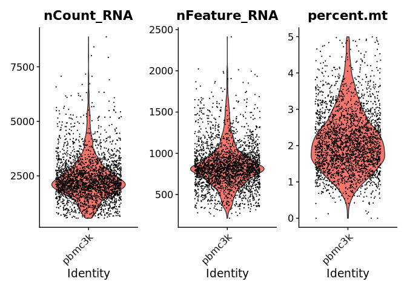

# scib

<!-- badges: start -->
<!-- badges: end -->

The goal of scib (single-cell integration and benchmarking) is to
provide a unified way to perform data integration and benchmarking when
the ground truth is available xxx.

# INSTALLATION

You can install the latest version scib like so:

``` r
library(remotes)
install_github("manjulapramila/scib")
```

# LOAD DATA FOR DEMONSTRATION

We will load the `pbmc.demo` dataset that is used in the fundamental
Seurat vignette. This is a Seurat object containing 2,700 peripheral
blood mononuclear cells (PBMC) from 10X genomics. See `help(pbmc.demo)`
for more details.

``` r
library(tidyverse)
library(Seurat)

library(scib)
data(pbmc.demo)
pbmc.demo
#> An object of class Seurat 
#> 13714 features across 2700 samples within 1 assay 
#> Active assay: RNA (13714 features, 0 variable features)
#>  2 layers present: counts, data
```

## Quality control

Like all single-cell dataset, we need to perform quality control to
ensure high quality dataset. Here we conduct a lenient quality control.

``` r
pbmc.demo$percent.mt <- PercentageFeatureSet(pbmc.demo, pattern = "^MT-|^Mt-")

VlnPlot(pbmc.demo, c("nCount_RNA", "nFeature_RNA", "percent.mt"))
```


``` r

pbmc.demo <- subset(pbmc.demo,
                      nFeature_RNA > 200 &
                      nFeature_RNA < 2500 &
                      percent.mt   < 5)
```

Aside: After quality control

``` r
pbmc.demo
#> An object of class Seurat 
#> 13714 features across 2638 samples within 1 assay 
#> Active assay: RNA (13714 features, 0 variable features)
#>  2 layers present: counts, data

VlnPlot(pbmc.demo, c("nCount_RNA", "nFeature_RNA", "percent.mt"))
```



## Ground truth

This dataset includes `seurat_annotations` provided by the Seurat
co-authors. We also included a `batch` column which is artificially
created for this package demonstration.

``` r
pbmc.demo@meta.data %>%
  glimpse()
#> Rows: 2,638
#> Columns: 6
#> $ orig.ident         <fct> pbmc3k, pbmc3k, pbmc3k, pbmc3k, pbmc3k, pbmc3k, pbm…
#> $ nCount_RNA         <dbl> 2419, 4903, 3147, 2639, 980, 2163, 2175, 2260, 1275…
#> $ nFeature_RNA       <int> 779, 1352, 1129, 960, 521, 781, 782, 790, 532, 550,…
#> $ seurat_annotations <fct> Memory CD4 T, B, Memory CD4 T, CD14+ Mono, NK, Memo…
#> $ batch              <chr> "B1", "B2", "B3", "B1", "B2", "B3", "B1", "B2", "B3…
#> $ percent.mt         <dbl> 3.0177759, 3.7935958, 0.8897363, 1.7430845, 1.22448…
```

``` r
pbmc.demo@meta.data %>% 
  janitor::tabyl(seurat_annotations, batch)
#>  seurat_annotations  B1  B2  B3
#>         Naive CD4 T 219 248 230
#>        Memory CD4 T 174 133 176
#>          CD14+ Mono 162 166 152
#>                   B 127 111 106
#>               CD8 T  92  87  92
#>        FCGR3A+ Mono  55  56  51
#>                  NK  44  63  48
#>                  DC   7  12  13
#>            Platelet   4   4   6
```

# DATA INTEGRATION

Aside: Seurat v5 stores information in the following layers

- `counts` layer: raw un-normalized counts
- `data` layer: normalized data, which is set correctly after
  `NormalizeData()`
- `scale.data` layer: z-scored/variance-stabilized data, which is set
  after `ScaleData()`

Here are the layers before the split

``` r
Layers(pbmc.demo)
#> [1] "counts" "data"
```

## Step 1: Split the Seurat object

We will split the RNA assay by the grouping factor that defines the
batch effect. In reality, batch effects may arise from differences
between donors, single-cell technology, sequencing platforms, timing,
reagents, or experimental conditions across laboratories.

``` r
pbmc.demo[["RNA"]] <- split(pbmc.demo[["RNA"]], f = pbmc.demo$batch)
```

Aside: We now can see that the counts and data layer has been split into
three layers each.

``` r
Layers(pbmc.demo)
#> [1] "counts.B1" "counts.B2" "counts.B3" "data.B1"   "data.B2"   "data.B3"
```

## Step 2: Preprocess each split

Next we need to run the standard preprocessing steps for each split.
This can be done via:

``` r
pbmc.demo <- pbmc.demo %>%
  NormalizeData(verbose = FALSE) %>%
  FindVariableFeatures(verbose = FALSE) %>%
  ScaleData(verbose = FALSE) %>%
  RunPCA(verbose = FALSE)
```

We can see this has created the `pca` reduction based on the
unintegrated data. We can determine the dimensional of this dataset from
the Elbow plot to be approximately 10.

``` r
Reductions(pbmc.demo)
#> [1] "pca"

ElbowPlot(pbmc.demo, ndims = 50, reduction = "pca")
```


``` r

ndims <- 10
```

## Step 3: Data integration step

This is the workhorse of the data integration process. Here is an
example on how to execute this with Harmony. The Harmony-corrected
embedding or integrated embedding is store in the `integrated.harmony`
reduction.

``` r
pbmc.demo <- IntegrateLayers(pbmc.demo,
                             method         = "HarmonyIntegration",
                             orig.reduction = "pca",
                             new.reduction  = "integrated.harmony",
                             verbose        = FALSE)

Reductions(pbmc.demo)
#> [1] "pca"                "integrated.harmony"
```

Other available methods that can be used with `IntegrateLayers()`:

| method  | package             | Publication |
|---------|---------------------|-------------|
| Harmony | Seurat              | ??          |
| CCA     | Seurat              | ??          |
| RPCA    | Seurat              | ??          |
| SCVI    | SeuratWrapper       | ??          |
| FastMNN | SeuratWrapper       | ??          |
| LIGER   | scib (this package) | ??          |
| BBKNN   | scib (this package) | ??          |

## Step 4: Cleanup after data integration

After the data integration, we no longer need the counts and data to be
split by the batch variable. Therefore we can join the layers.

``` r
Layers(pbmc.demo)  # before
#> [1] "counts.B1"  "counts.B2"  "counts.B3"  "data.B1"    "data.B2"   
#> [6] "data.B3"    "scale.data"

pbmc.demo <- JoinLayers(pbmc.demo)

Layers(pbmc.demo)  # after
#> [1] "data"       "counts"     "scale.data"
```

The `scale.data` layer is a non-sparse matrix and not needed for further
analysis. Therefore, we can remove this layer to reduce the object size.

``` r
object.size(pbmc.demo) %>% format(units = "Mb")  # before
#> [1] "98.4 Mb"

pbmc.demo[["RNA"]]$scale.data  <- NULL
pbmc.demo@assays$RNA@meta.data <- data.frame()

object.size(pbmc.demo) %>% format(units = "Mb")  # after
#> [1] "56.2 Mb"
```

## Step 5: Processing the integrated data

We can now run the non-linear dimension reduction on the integrated
embedding and save it. Here the `ndims` is the dimensionality of the
dataset that we determined earlier.

``` r
pbmc.demo <- RunUMAP(pbmc.demo,
                     dims           = 1:ndims,
                     reduction      = "integrated.harmony",
                     reduction.name = "umap.harmony",
                     verbose        = FALSE
) 

DimPlot(pbmc.demo, reduction = "umap.harmony") +
  NoLegend()
```


Alternatively, we can also cluster the cells at certain resolution based
on the integrated embedding.

``` r
pbmc.demo <- FindNeighbors(pbmc.demo, reduction = "integrated.harmony")

pbmc.demo <- FindClusters (pbmc.demo, res = 0.8)
#> Modularity Optimizer version 1.3.0 by Ludo Waltman and Nees Jan van Eck
#> 
#> Number of nodes: 2638
#> Number of edges: 93493
#> 
#> Running Louvain algorithm...
#> Maximum modularity in 10 random starts: 0.8381
#> Number of communities: 11
#> Elapsed time: 0 seconds

DimPlot(pbmc.demo,
        reduction = "umap.harmony",
        group.by  = "RNA_snn_res.0.8",
        label     = TRUE) +
  NoLegend()
```


# EVALUATION

## Cross tabulation with the ground truth

We can compare the clusters based on the integrated embedding vs. the
ground truth provided by the Seurat authors:

``` r
tb <- table(pbmc.demo$seurat_annotations, pbmc.demo$RNA_snn_res.0.8)

print.table(tb, zero.print = ".")
#                0   1   2   3   4   5   6   7   8   9  10  11
# Naive CD4 T  384  22   . 234   .   .  57   .   .   .   .   .
# Memory CD4 T  10 337   .  88   .   .  42   .   .   6   .   .
# CD14+ Mono     .   .   .   . 241 232   .   2   .   .   5   .
# B              .   1 343   .   .   .   .   .   .   .   .   .
# CD8 T          .   6   1   .   .   . 129   .   5 130   .   .
# FCGR3A+ Mono   .   .   .   .   9   1   . 152   .   .   .   .
# NK             .   .   .   .   .   .   .   . 148   7   .   .
# DC             .   .   .   .   .   .   .   .   .   .  32   .
# Platelet       .   .   .   .   .   .   .   .   .   .   .  14
```

There are several ways of estimating the performance of the data
integration technique. Accuracy is one of the simpler method.

1.  Assign every cluster to one label using simple majority (e.g. 0 =
    Naive CD4 T, 1 = Memory CD4 T, 2 = B, …, 11 = Platelet).

2.  Add up the numbers that correspond to this majority based assignment
    (384 + 337 + 343 + 234 + 241 + 232 + 129 + 152 + 148 + 130 + 32 +
    14). This totals to 2,376 here.

3.  Divide by the total number of cells. i.e. 2376 / 2638 which gives
    90%.

However, there are more sophisticated metrics for evaluation which we
cover next.

## Evaluate the data integration

``` r
EvaluateSCIB(pbmc.demo, 
             reduction   = "integrated.harmony", 
             groundtruth = "seurat_annotations")

kbet
asw
lsi
ari
lisi
```
