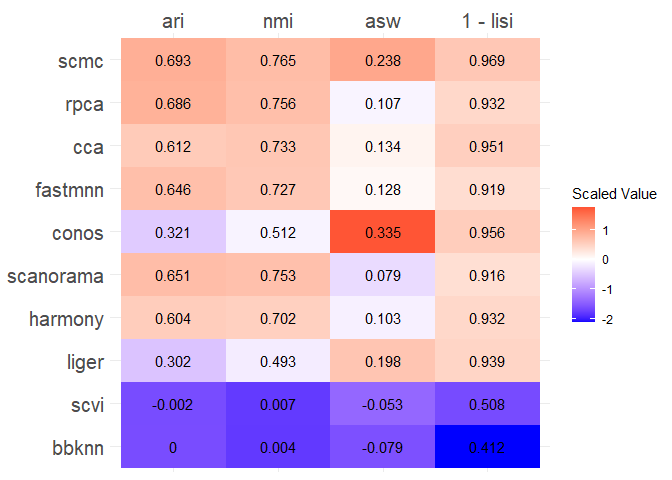

Please ensure you completed: [Example of running and evaluating one data
integration method](scib_one_method.md)

# SETUP

``` r
pacman::p_load(tidyverse, janitor, reticulate,
               Seurat, SeuratWrappers, scib)
```

``` r
python_binary <- conda_list() %>%
  filter(name == "scib") %>%
  pull(python) %>% 
  normalizePath(winslash = "/")

use_python(python_binary, required = TRUE)

conda_env <- dirname(python_binary)
```

# LOAD & PREPARE THE DATASET

We can load the `pbmc.demo` dataset and run through Steps 1 - 2:

``` r
## Load data
data(pbmc.demo, package = "scib")

## Step 1: Split the Seurat object
pbmc.demo[["RNA"]] <- split(pbmc.demo[["RNA"]], f = pbmc.demo$batch)

## Step 2: Preprocess each split
pbmc.demo <- pbmc.demo %>%
  NormalizeData(verbose = FALSE) %>%
  FindVariableFeatures(verbose = FALSE) %>%
  ScaleData(verbose = FALSE) %>%
  RunPCA(verbose = FALSE)

ndims <- 10  # determined from Elbowplot(pbmc.demo) earlier
```

``` r
pbmc.demo
#> An object of class Seurat 
#> 13714 features across 2638 samples within 1 assay 
#> Active assay: RNA (13714 features, 2000 variable features)
#>  7 layers present: counts.B1, counts.B2, counts.B3, data.B1, data.B2, data.B3, scale.data
#>  1 dimensional reduction calculated: pca
```

# RUNNING MULTIPLE DATA INTEGRATION METHODS

We can repeat Steps 3 - 4 with all the methods.

``` r
methods <- c(
  "BBKNNIntegration", 
  "CCAIntegration", 
  "CONOSIntegration", 
  "FastMNNIntegration", 
  "HarmonyIntegration", 
  "LIGERIntegration",
  "RPCAIntegration", 
  "SCANORAMAIntegration",
  "SCMCIntegration", 
  "scVIIntegration")

big.res <- list()

for(method in methods){
  
  cat(method, "\t", date(), "\n")

  ptm <- Sys.time()
  
  method.name <- gsub("Integration", "", method) %>% str_to_lower()

  ## Step 3: Data integration step
  pbmc.demo <- IntegrateLayers2(object         = pbmc.demo,
                                method         = method,
                                orig.reduction = "pca",
                                new.reduction  = paste0("integrated.", method.name),
                                verbose        = FALSE,
                                ndims          = ndims,
                                resolution     = 0.80,
                                conda_env      = conda_env
  )
  
  
  ## Step 4: Processing the integrated data
  pbmc.demo <- FindNeighbors(pbmc.demo, reduction = paste0("integrated.", method.name), verbose = FALSE)
  pbmc.demo <- FindClusters (pbmc.demo, res = 0.80, cluster.name = paste0("cluster.", method.name), verbose = FALSE)
  pbmc.demo$seurat_clusters <- NULL
  
  
  ## Step 6: Evaluate the data integration method
  res <- run_eval_metrics(pbmc.demo, 
                          reduction      = paste0("integrated.", method.name),  
                          predicted.cn   = paste0("cluster.", method.name),
                          groundtruth.cn = "seurat_annotations")

  dtm <- difftime( Sys.time(), ptm, units = "mins" ) %>% as.numeric()
  
  res <- data.frame( c(res, "time_minutes"=dtm) )
  colnames(res) <- method.name
  big.res[[method]]  <- res
  
  ## Cleanup
  pbmc.demo@graphs$RNA_nn  <- NULL
  pbmc.demo@graphs$RNA_snn <- NULL
  pbmc.demo@meta.data[ , paste0("cluster.", method.name)] <- NULL
  rm(res, dtm)
}

big.res <- do.call("cbind", big.res)

round(big.res, digits = 3)
```

|                      |  bbknn |    cca | conos | fastmnn | harmony | liger |   rpca | scanorama |   scmc |   scvi |
|:---------------------|-------:|-------:|------:|--------:|--------:|------:|-------:|----------:|-------:|-------:|
| n_celltype           |  9.000 |  9.000 | 9.000 |   9.000 |   9.000 | 9.000 |  9.000 |     9.000 |  9.000 |  9.000 |
| ari_celltype         |  0.000 |  0.612 | 0.321 |   0.646 |   0.604 | 0.302 |  0.686 |     0.651 |  0.693 | -0.002 |
| nmi_celltype         |  0.004 |  0.733 | 0.512 |   0.727 |   0.702 | 0.493 |  0.756 |     0.753 |  0.765 |  0.007 |
| asw_celltype         | -0.079 |  0.134 | 0.335 |   0.128 |   0.103 | 0.198 |  0.107 |     0.079 |  0.238 | -0.053 |
| lisi_mean_celltype   |  0.588 |  0.146 | 0.153 |   0.130 |   0.146 | 0.130 |  0.146 |     0.131 |  0.072 |  0.490 |
| lisi_median_celltype |  0.588 |  0.049 | 0.044 |   0.081 |   0.068 | 0.061 |  0.068 |     0.084 |  0.031 |  0.492 |
| n_batch              |  3.000 |  3.000 | 3.000 |   3.000 |   3.000 | 3.000 |  3.000 |     3.000 |  3.000 |  3.000 |
| ari_batch            |  0.000 |  0.000 | 0.128 |   0.000 |   0.000 | 0.221 |  0.001 |     0.001 |  0.000 |  0.000 |
| nmi_batch            |  0.001 |  0.001 | 0.236 |   0.002 |   0.001 | 0.310 |  0.002 |     0.002 |  0.001 |  0.001 |
| asw_batch            | -0.005 | -0.022 | 0.015 |  -0.015 |  -0.003 | 0.156 | -0.007 |    -0.003 | -0.007 | -0.011 |
| lisi_mean_batch      |  0.868 |  0.448 | 0.185 |   0.595 |   0.742 | 0.087 |  0.744 |     0.753 |  0.730 |  0.791 |
| lisi_median_batch    |  0.889 |  0.437 | 0.007 |   0.581 |   0.771 | 0.021 |  0.774 |     0.783 |  0.766 |  0.825 |
| kbet_batch           |  0.981 |  0.093 | 0.112 |   0.239 |   0.970 | 0.015 |  0.799 |     0.949 |  0.932 |  0.962 |
| time_minutes         |  0.348 |  0.486 | 0.850 |   0.472 |   0.311 | 0.316 |  0.465 |     0.479 |  0.542 | 12.402 |

Let’s look at the ARI, NMI, ASW and 1 - LISI values for celltype.

``` r
methods <- paste0( c("ari", "nmi", "asw", "lisi_median"), "_celltype" )

mdf <- big.res[ methods, ] %>% t() %>% data.frame()
mdf$"1 - lisi" <- 1 - mdf$lisi_median_celltype
mdf$lisi_median_celltype <- NULL
colnames(mdf) <- gsub("_celltype", "", colnames(mdf))
mdf
#>                     ari         nmi         asw  1 - lisi
#> bbknn      8.554657e-08 0.004474116 -0.07894693 0.4117330
#> cca        6.117469e-01 0.732841313  0.13374386 0.9508332
#> conos      3.206525e-01 0.512065996  0.33461303 0.9560595
#> fastmnn    6.458899e-01 0.727237701  0.12801674 0.9193391
#> harmony    6.036724e-01 0.702122142  0.10263502 0.9322724
#> liger      3.021307e-01 0.492884852  0.19823485 0.9391036
#> rpca       6.860071e-01 0.756073725  0.10702682 0.9319175
#> scanorama  6.513866e-01 0.753097825  0.07899968 0.9161985
#> scmc       6.926854e-01 0.764722125  0.23835909 0.9685411
#> scvi      -1.540208e-03 0.006708437 -0.05308872 0.5084109
```

We can visualize this via a heatmap:

``` r
## Reshape data to long format
melted <- mdf %>% 
  as.matrix() %>% 
  reshape2::melt(varnames = c("method", "metric")) %>% 
  as.data.frame() %>% 
  group_by(metric) %>% 
  mutate(value_scaled = as.numeric(scale(value)))

## re-order the methods by sum of scaled values
ord <- melted %>%
  group_by(method) %>%
  summarise(product = sum(value_scaled)) %>% 
  arrange(product) %>% 
  pull(method) %>% 
  as.character()

melted$method <- factor(melted$method, levels = ord)

## Heatmap
ggplot(melted, aes(x = metric, y = method, fill = value_scaled)) +
  geom_tile() +
  geom_text(aes(label = round(value, 3)), color = "black") +
  scale_fill_gradient2(low = "blue", mid = "white", high = "red", midpoint = 0) +
  theme_minimal() +
  theme(axis.text.x.top = element_text(angle = 0, hjust = 0.5, size = 15),
        axis.text.y.left = element_text(size = 15)) +
  scale_x_discrete(position = "top") +
  labs(fill = "Scaled Value", title = NULL, x = NULL, y = NULL)
```



It looks like scMC method is performing well in this dataset but we need
to test this in a wide variety of real datasets.
