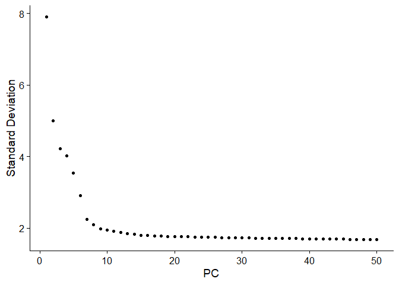
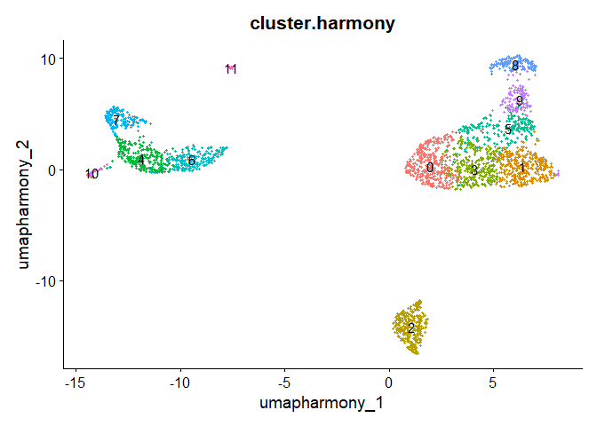

# SETUP

``` r
pacman::p_load(tidyverse, janitor, reticulate,
               Seurat, SeuratWrappers, scib)
```

``` r
python_binary <- conda_list() %>%
  filter(name == "scib") %>%
  pull(python) %>% 
  normalizePath(winslash = "/")

use_python(python_binary, required = TRUE)

conda_env <- dirname(python_binary)
```

# LOAD DATA FOR DEMONSTRATION

We will load the `pbmc.demo` dataset which is a Seurat object containing
2,638 peripheral blood mononuclear cells (PBMC). The data is provided by
10X genomics and similar to the one use in fundamental Seurat vignette
with pbmc3k.

``` r
data(pbmc.demo, package = "scib")

pbmc.demo
#> An object of class Seurat 
#> 13714 features across 2638 samples within 1 assay 
#> Active assay: RNA (13714 features, 0 variable features)
#>  2 layers present: counts, data
```

The meta data contains two columns of interest to us:

1)  `seurat_annotations` provided by the Seurat co-authors and this
    serves as the ground truth for evaluation.

2)  `batch` which was artificially generated for demonstration.

``` r
pbmc.demo@meta.data %>%
  tabyl(seurat_annotations, batch)
#>  seurat_annotations  B1  B2  B3
#>         Naive CD4 T 219 248 230
#>        Memory CD4 T 174 133 176
#>          CD14+ Mono 162 166 152
#>                   B 127 111 106
#>               CD8 T  92  87  92
#>        FCGR3A+ Mono  55  56  51
#>                  NK  44  63  48
#>                  DC   7  12  13
#>            Platelet   4   4   6
```

Aside: Seurat v5 stores information in the following layers

- `counts` layer: raw un-normalized counts
- `data` layer: normalized data, which is set correctly after
  `NormalizeData()`
- `scale.data` layer: z-scored/variance-stabilized data, which is set
  after `ScaleData()`

Here are the layers before the split

``` r
Layers(pbmc.demo)
#> [1] "counts" "data"
```

# DATA INTEGRATION

## Step 1: Split the Seurat object

We split the RNA assay by the batch effect. In reality, batch effects
may arise from differences between donors, single-cell technology,
sequencing platforms, timing, reagents, or experimental conditions
across laboratories.

``` r
pbmc.demo[["RNA"]] <- split(pbmc.demo[["RNA"]], f = pbmc.demo$batch)

pbmc.demo
#> An object of class Seurat 
#> 13714 features across 2638 samples within 1 assay 
#> Active assay: RNA (13714 features, 0 variable features)
#>  6 layers present: counts.B1, counts.B2, counts.B3, data.B1, data.B2, data.B3
```

The counts and data layer has been split into three layers each.

## Step 2: Preprocess each split

We run the standard preprocessing steps for each split.

``` r
pbmc.demo <- pbmc.demo %>%
  NormalizeData(verbose = FALSE) %>%
  FindVariableFeatures(verbose = FALSE) %>%
  ScaleData(verbose = FALSE) %>%
  RunPCA(verbose = FALSE)

pbmc.demo
#> An object of class Seurat 
#> 13714 features across 2638 samples within 1 assay 
#> Active assay: RNA (13714 features, 2000 variable features)
#>  7 layers present: counts.B1, counts.B2, counts.B3, data.B1, data.B2, data.B3, scale.data
#>  1 dimensional reduction calculated: pca
```

The `pca` reduction has been generated based on the unintegrated data.
We can determine the **dimensionality of this dataset** from the Elbow
plot to be approximately 10.

``` r
ElbowPlot(pbmc.demo, ndims = 50, reduction = "pca")
```



``` r

ndims <- 10
```

## Step 3: Data integration step

This is the workhorse of the data integration process. Here is an
example on how to execute this with Harmony. The integrated embedding is
stored in the `integrated.harmony` reduction.

``` r
pbmc.demo <- IntegrateLayers2(pbmc.demo,
                              method         = "HarmonyIntegration",
                              orig.reduction = "pca",
                              new.reduction  = "integrated.harmony",
                              verbose        = FALSE)

Reductions(pbmc.demo)
#> [1] "pca"                "integrated.harmony"
```

## Step 4: Processing the integrated data

We can now run the non-linear dimension reduction on the integrated
embedding.

``` r
pbmc.demo <- RunUMAP(pbmc.demo,
                     dims           = 1:ndims,
                     reduction      = "integrated.harmony",
                     reduction.name = "umap.harmony",
                     verbose        = FALSE
)

Reductions(pbmc.demo)
#> [1] "pca"                "integrated.harmony" "umap.harmony"
```

Next, we cluster the cells at certain resolution based on the integrated
embedding. We chose `res = 0.80` here for demonstration but you should
determine this for your own dataset.

``` r
pbmc.demo <- FindNeighbors(pbmc.demo, reduction = "integrated.harmony")

pbmc.demo <- FindClusters (pbmc.demo, res = 0.80, cluster.name = "cluster.harmony")
#> Modularity Optimizer version 1.3.0 by Ludo Waltman and Nees Jan van Eck
#> 
#> Number of nodes: 2638
#> Number of edges: 93314
#> 
#> Running Louvain algorithm...
#> Maximum modularity in 10 random starts: 0.8386
#> Number of communities: 12
#> Elapsed time: 0 seconds
```

Aside: We can visualize these clusters on the harmony-corrected
embedding based UMAP.

``` r
DimPlot(pbmc.demo,
        reduction = "umap.harmony",
        group.by  = "cluster.harmony",
        label     = TRUE) +
  NoLegend()
```



## (optional) Step 5: Cleanup after data integration

Before the cleanup:

``` r
Layers(pbmc.demo)
#> [1] "counts.B1"  "counts.B2"  "counts.B3"  "data.B1"    "data.B2"   
#> [6] "data.B3"    "scale.data"
object.size(pbmc.demo) %>% format(units = "Mb")
#> [1] "102.4 Mb"
```

We can join the data layers, count layers and remove the `scale.data`
(non-sparse matrix) to reduce object size.

``` r
pbmc.demo <- JoinLayers(pbmc.demo)
pbmc.demo[["RNA"]]$scale.data  <- NULL
```

We can confirm this by checking the layers and observing the reduction
in object size (from 102Mb to 62Mb).

``` r
object.size(pbmc.demo) %>% format(units = "Mb")  
#> [1] "61.8 Mb"

pbmc.demo
#> An object of class Seurat 
#> 13714 features across 2638 samples within 1 assay 
#> Active assay: RNA (13714 features, 2000 variable features)
#>  2 layers present: data, counts
#>  3 dimensional reductions calculated: pca, integrated.harmony, umap.harmony
```

# EVALUATION

## Cross tabulation with the ground truth

We can compare the clusters based on the integrated embedding vs. the
ground truth provided by the Seurat authors:

``` r
tb <- table(pbmc.demo$seurat_annotations, pbmc.demo$cluster.harmony)

print.table(tb, zero.print = ".")
#                0   1   2   3   4   5   6   7   8   9  10  11
# Naive CD4 T  382  22   . 239   .  54   .   .   .   .   .   .
# Memory CD4 T   9 339   .  88   .  42   .   .   .   5   .   .
# CD14+ Mono     .   .   .   . 251   . 224   2   .   .   3   .
# B              .   1 343   .   .   .   .   .   .   .   .   .
# CD8 T          .   5   1   .   . 130   .   .   5 130   .   .
# FCGR3A+ Mono   .   .   .   .   5   .   1 156   .   .   .   .
# NK             .   .   .   .   .   .   .   . 148   7   .   .
# DC             .   .   .   .   .   .   .   .   .   .  32   .
# Platelet       .   .   .   .   .   .   .   .   .   .   .  14
```

There are several ways of estimating the performance of the data
integration technique. Accuracy is one of the simpler method.

1.  Assign every cluster to one label using simple majority

``` r
pbmc.demo$ann.harmony <- case_match(pbmc.demo$cluster.harmony,
                                    "0" ~ "Naive CD4 T",
                                    "1" ~ "Memory CD4 T",
                                    "2" ~ "B",
                                    "3" ~ "Naive CD4 T",
                                    "4" ~ "CD14+ Mono",
                                    "5" ~ "CD8 T",
                                    "6" ~ "CD14+ Mono",
                                    "7" ~ "FCGR3A+ Mono",
                                    "8" ~ "NK",
                                    "9" ~ "CD8 T",
                                    "10" ~ "DC",
                                    "11" ~ "Platelet")
```

2.  Add up the numbers that correspond to this majority based
    assignment: 382 + 339 + 343 + 239 + 251 + 130 + 224 + 156 + 148 +
    130 + 32 + 14 which adds up to 2,388.

3.  Divide by the total number of cells. i.e. 2388 / 2638 which gives
    90.5%.

``` r
100 * mean(pbmc.demo$ann.harmony == pbmc.demo$seurat_annotations)
#> [1] 90.52312
```

However, there are more sophisticated metrics for evaluation which we
cover next.

## Evaluate the data integration

``` r
results <- run_eval_metrics(pbmc.demo, 
                            reduction      = "integrated.harmony", 
                            predicted.cn   = "cluster.harmony",
                            groundtruth.cn = "seurat_annotations")

data.frame(results)
#                            results
# n_celltype            9.0000000000
# ari_celltype          0.6097111530
# nmi_celltype          0.7054868932
# asw_celltype          0.1027220944
# lisi_mean_celltype    0.1459063973
# lisi_median_celltype  0.0674748762
# n_batch               3.0000000000
# ari_batch            -0.0002237677
# nmi_batch             0.0012540544
# asw_batch            -0.0028503476
# lisi_mean_batch       0.7411130657
# lisi_median_batch     0.7707188999
# kbet_batch            0.9715909091
```
